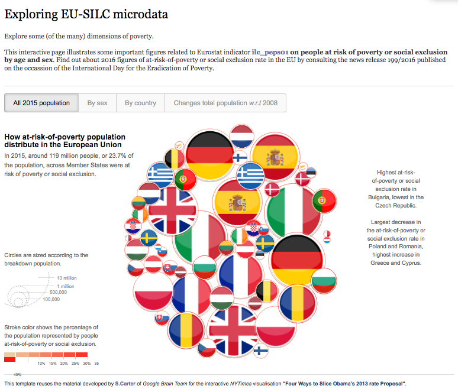

d3force@ESTAT
=============

Applying `d3` force layout for exploring EU-SILC indicators
---

**About**

This page provides relevant tools used to prepare selected social indicator data downloaded from [ESTAT website](http://ec.europa.eu/eurostat/data/database) and provide an interactive based on [`d3-force` layout](https://github.com/d3/d3-force). These tools largely reuse the material developed by S.Carter for the _New York Times_ publication mentioned below [below](#References).

**Description**

The webpage [peps01_slice.html](https://github.com/gjacopo/bodylanguage/blob/master/d3force/peps01_slice.html) illustrates some important figures related to ESTAT indicator _ilc_peps01_ on *people at risk of poverty or social exclusion* by age and sex (see also the  news release [below](#References)). The front page (first tab selected) looks like this: 
 

To see the actual interactive visualisation, you need to download the webpage and display it locally in your browser. You can get a preview of this page using `rawgit`: check this [address](https://cdn.rawgit.com/gjacopo/bodylanguage/b245c372/d3force/peps01_slice.html), though some features of the visualisation are disabled.

**Usage** 

**References**

* `d3` documentation: [wiki gallery](https://github.com/d3/d3/wiki/Gallery).
* _New York Times_: [Four ways to slice Obama's 2013 budget proposal](http://www.nytimes.com/interactive/2012/02/13/us/politics/2013-budget-proposal-graphic.html).
* Eurostat press release 199/2016: [The share of persons at risk of poverty or social exclusion in the EU back to its pre-crisis level](http://ec.europa.eu/eurostat/documents/2995521/7695750/3-17102016-BP-EN.pdf).
* Eurostat bubble chart: [My country in a bubble](http://ec.europa.eu/eurostat/cache/BubbleChart/).
