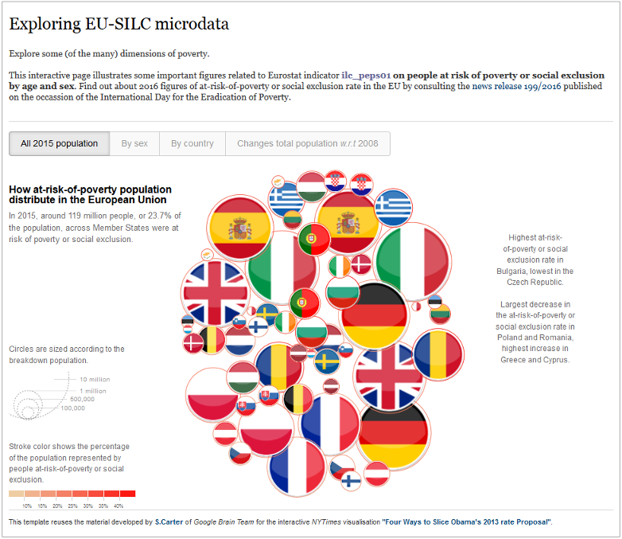

d3force@ESTAT
=============

Applying `d3` force layout for exploring EU-SILC indicators
---

**About**

http://htmlpreview.github.io/?https://github.com/gjacopo/bodylanguage/blob/master/d3force/peps01_slice.html

**Description**

**Usage** 

**Reference**

* `d3` documentation: [wiki gallery](https://github.com/d3/d3/wiki/Gallery).
* `d3` documentation: [`force` layout](https://github.com/d3/d3-force).
* _New York Times_: [Four ways to slice Obama's 2013 budget proposal](http://www.nytimes.com/interactive/2012/02/13/us/politics/2013-budget-proposal-graphic.html).
* Eurostat press release 199/2016: [The share of persons at risk of poverty or social exclusion in the EU back to its pre-crisis level](http://ec.europa.eu/eurostat/documents/2995521/7695750/3-17102016-BP-EN.pdf).
* Eurostat bubble chart: [My country in a bubble](http://ec.europa.eu/eurostat/cache/BubbleChart/).
