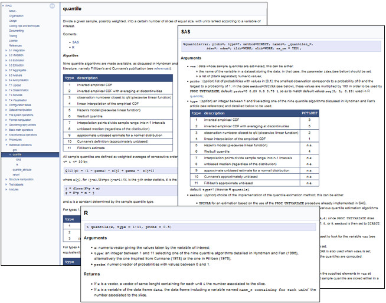

##### `doxy@ESTAT` Examples

Some actual use of the script and implementation how-to's:
* [`PING` documentation](example_ping) whose generated documentation can be found [here](https://gjacopo.github.io/PING/).

<table>
<tr>
<td align="centre"><kbd> </kbd></td>
</tr>
<footer>
<td align="centre"><i>Statistical operations are documented regardless of the programming languages: in this example, the documentation of a quantile estimation is provided for both <code>SAS</code> and <code>R</code> implementations.</i></td>
</footer>
</table>