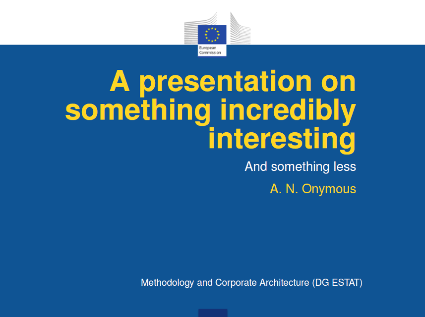

estatbeam
========

Eurostat layout style/template for `LaTeX` beamer presentation.
---

The `LaTeX` style file stored herein: 
* `beamer-estat.sty`

together with some "background" layouts:
* `slide-title-background-estat.png` for (first) titlepage, and
* `slide-background-estat.png` for other pages.

can be used to create presentation with Eurostat layout.

See some [example](examples/example-beamer-estat.tex) and the [output presentation](examples/example-beamer-estat.pdf) in `pdf` format:
<table>
<tr>
<td><kbd></kbd></td>
</tr>
</table>
