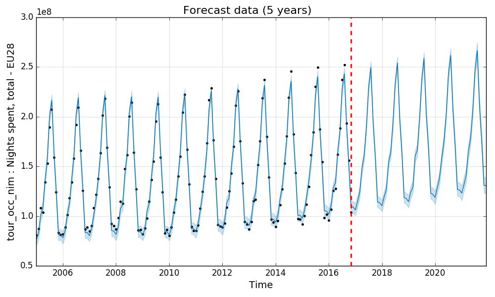

Prophet@ESTAT
=============

Applying Facebook `Prophet` model for forecasting ESTAT monthly indicators
---

**About**

This is a **blind/dummy** (no assumption whatsoever) application of  [`Prophet`](https://facebookincubator.github.io/prophet/) automatic procedure for forecast estimates of ESTAT [*tour_occ_nim*](http://appsso.eurostat.ec.europa.eu/nui/show.do?dataset=tour_occ_nim&lang=en) time-series on the number of *"nights spent at tourist accommodation establishments"*) per month.

**Description**

At its core, the [`Prophet`](https://facebookincubator.github.io/prophet/) procedure is an additive regression model with four main components (using [`Stan`](http://mc-stan.org/) Bayesian approach, see reference [below](#Reference)):
* a piecewise linear (or logistic) growth curve trend: Prophet automatically detects changes in trends by selecting changepoints from the data,
* a yearly seasonal component modeled using Fourier series,
* a weekly seasonal component using dummy variables,
* a user-provided list of important holidays.

In practice, non-linear trends are fit with yearly and weekly seasonality (plus holidays). `Prophet` is robust to missing data, shifts in the trend, and large outliers.

**Usage**

Facebook has open sourced  [`Prophet software`](https://github.com/facebookincubator/prophet), a forecasting project with an interface available in `Python` ([here](https://pypi.python.org/pypi/fbprophet/)). We will use this resource. 

Run the `tour_forecast.py` source code or explore the `tour_forecast.ipynb` notebook to produce the following forecast estimates of ESTAT [*tour_occ_nim*] monthly indicator:

**Reference**

* Taylor, S.J. and Letham, B. (2017): [Forecasting at Scale](https://facebookincubator.github.io/prophet/static/prophet_paper_20170113.pdf).
